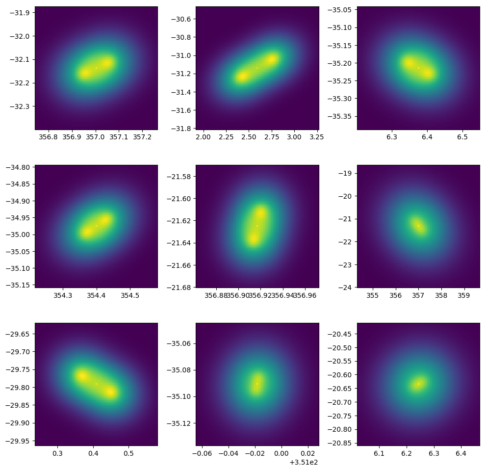

# TRECS2OSKAR
This README isn't a proper documentation, will more be an overview of the code, and will explain which bits are hard-coded, that you probably want to change if you're going to use it. I'll chuck **TODO**s throughout for anything I think is dodgy that might need checking as well

As a brief overview, I wrote this to code to have a large and deep as possible sky model for SKA_LOW at 150MHz, that could be processed with as little GPU time as possible. To do that, the code takes the the large-sky FITS files linked in the original TRECS paper (https://doi.org/10.1093/mnras/sty2603) and does the following:
1. Does a flux cut to reduce the number of sources for less compute time in OSKAR sims
2. Moves the tables from DEC centre $\delta_0=0^\circ$ to $\delta_0=-26.7^\circ$ so it's directly over the MRO
3. Converts the TRECS sources into OSKAR sky models. SFG galaxies are either a single point source or a single gaussian, AGN are a combination of 4 gaussians to try to create hot-spots and lobes, and a point source for the central core.

As an aside, this code was written to work with `python2.7`, and makes OSKAR (v2.7) sky models.

### 1. Obtaining the data
(Included this in case it's useful). You can use this bash script to obtain the data, via the wget command:
```sh
./wget_the_data.sh
```
(The total data set is > 30GB so download what you need/want if stuck for space)

### 2. Reducing the data size
The following command:
```sh
python flux_cut_and_reproject.py --fitsfile=catalogue_AGNs_complete_wide.fits \
    --flux_cut=0.5
```
will produce the catalogue `catalogue_AGNs_complete_wide_reduced.fits`. The argument `--flux_cut=0.5` cuts anything below 0.5mJy (which were the settings I ran with for my talk in Manchester). `flux_cut_and_reproject.py` also has the option to do a flux cut by confusion noise for a given maximum baseline length.

It also takes the current declination field centre of $\delta_0=0^\circ$ and moves it to $\delta_0=-26.7^\circ$, attempting to scale the RA appropriately depending on the new declination. **TODO** Remove/check the trigo of the co-ordinate transform.

Finally, the script on takes a certain amount of columns from the original cats, just enough to calculate a single SI for each source, and some size parameters. **TODO** this is all hard-coded to 150MHz so would need to be adapted.

### 3. Converting to .osm
Running the command
```sh
python create_osm.py --TRECS_tables=files_to_convert.txt \
    --osm=TRECS_sky.osm --plot_AGN --plot_SFG
```
will convert the `*reduced.fits` listed in `files_to_convert.txt` into an OSKAR sky model. The SFG are either represented by a single gaussian or just a point source, depending on how big they are (**TODO** you could make that a user supplied argument - I set it to 30 arcsec).

The AGN are built using one point source and 4 gaussians; I simplify an AGN into consisting of a point source core, 2 gaussian hotspots, and 2 gaussian lobes (to try and get some kind of diffuse emission from the AGN). I use the TRECS $R_s$ and size params to set the location and size of the hoptspot and lobes. I've heavily commented the code to try and explain how I do that.

The optional arguments `--plot_AGN` and `--plot_SFG` show you examples of the sources being included. Example AGN look like this:



**TODO** The amount of flux split between the core, hoptspots and lobes is hard-coded and the same for all AGN - you probably want to randomise that, and maybe give options to the user for acceptable ranges?

## 4. Visualise OSKAR sky model
As an added bonus, I've included my attempt at taking an .osm sky model and convolving it with a restoring beam, to anticipate what a perfect CLEANed image of the sky model would look like. It's all hard coded and I haven't had time to comment it, but I've included it in case it's useful for Fred. Currently you just do
```sh
python plot_osm.py
```
which produces the raw sky model `TRECS_sky_raw.fits` and the instrument convolved `TRECS_sky_convolved.fits` (I haven't included these FITS files because they are >100MB each, but they are quick to generate). The convolved FITS looks like this:


